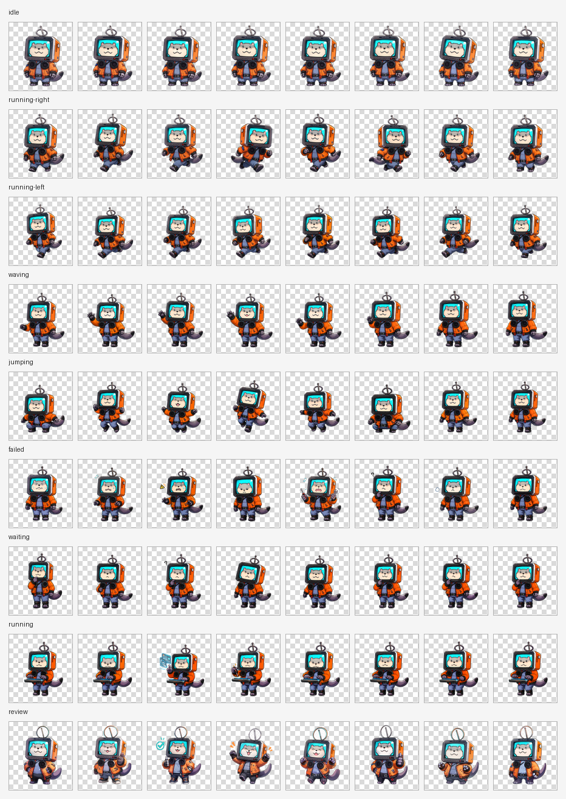

# Taygedo Codex Pet

Language: English | [Simplified Chinese](README.zh-CN.md)

Custom Taygedo pet assets for Codex. This repository contains the installable pet manifest and spritesheet, plus the source frames, previews, and processing reports used to build the final asset.



## Install With Codex

Open this repository in Codex and ask:

```text
Please follow AGENTS.md and install this Taygedo Codex pet for me.
```

Codex should follow [AGENTS.md](AGENTS.md). The preferred install command is:

```powershell
powershell -ExecutionPolicy Bypass -File .\scripts\install.ps1
```

The script backs up any existing `taygedo` pet folder before installing the current one.

## Manual Install

Copy or clone this repository to:

```text
%USERPROFILE%\.codex\pets\taygedo
```

The required runtime files are:

```text
pet.json
spritesheet.png
```

After installation, refresh the Codex pet list or restart Codex. The pet display name is `Taygedo`.

## Format

- Spritesheet size: `1536 x 1872`
- Frame grid: `8 columns x 9 rows`
- Frame size: `192 x 208`
- Image format: RGBA PNG with transparency

## Animation Rows

| Row | State | Description |
| --- | --- | --- |
| 0 | idle | Idle |
| 1 | running-right | Moving right |
| 2 | running-left | Moving left |
| 3 | waving | Waving |
| 4 | jumping | Jumping |
| 5 | failed | Failure or error |
| 6 | waiting | Waiting or thinking |
| 7 | running | Working |
| 8 | review | Success or review |

## Repository Layout

```text
.
|-- AGENTS.md
|-- README.md
|-- README.zh-CN.md
|-- pet.json
|-- spritesheet.png
|-- scripts/
|   `-- install.ps1
|-- docs/
|   |-- generated-images-contact-sheet.png
|   |-- processed-preview-contact-sheet.png
|   |-- processed-preview-normalized-contact-sheet.png
|   |-- processing-report.json
|   `-- normalization-report.json
`-- assets/
    |-- spritesheet-before-normalize.png
    |-- spritesheet-normalized.png
    |-- raw-generated-frames/
    `-- processed-frames/
```

## Notes

The final `spritesheet.png` has been normalized so the character size is more consistent between frames. The pre-normalized version is kept at `assets/spritesheet-before-normalize.png`.

The original generated frames are kept in `assets/raw-generated-frames/`. The transparent processed single frames are kept in `assets/processed-frames/`.
